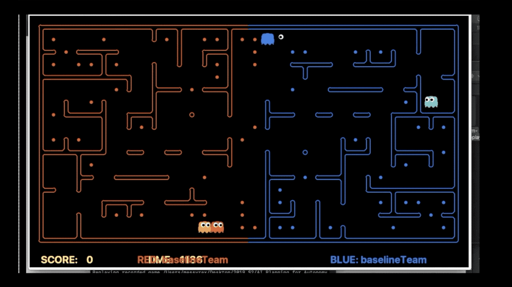
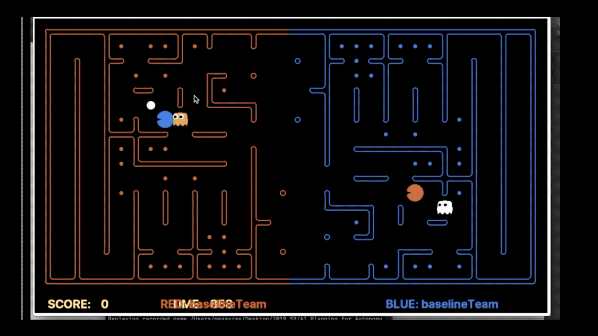
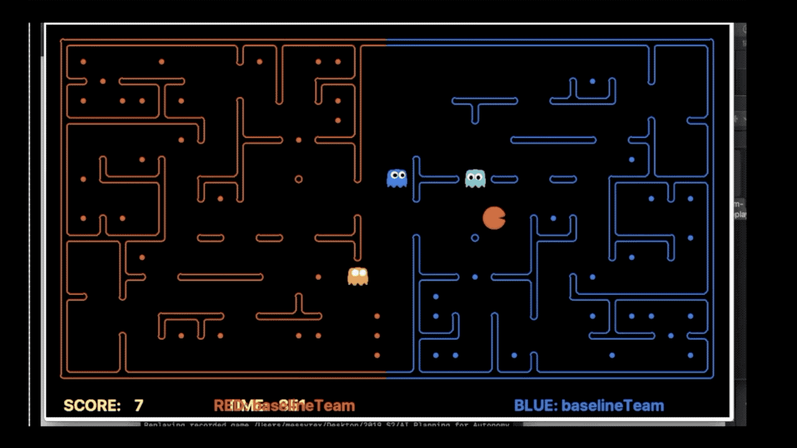
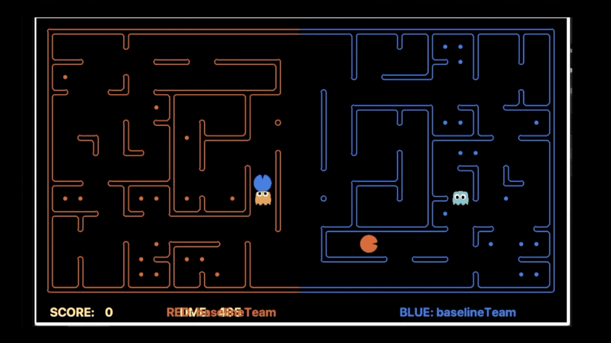
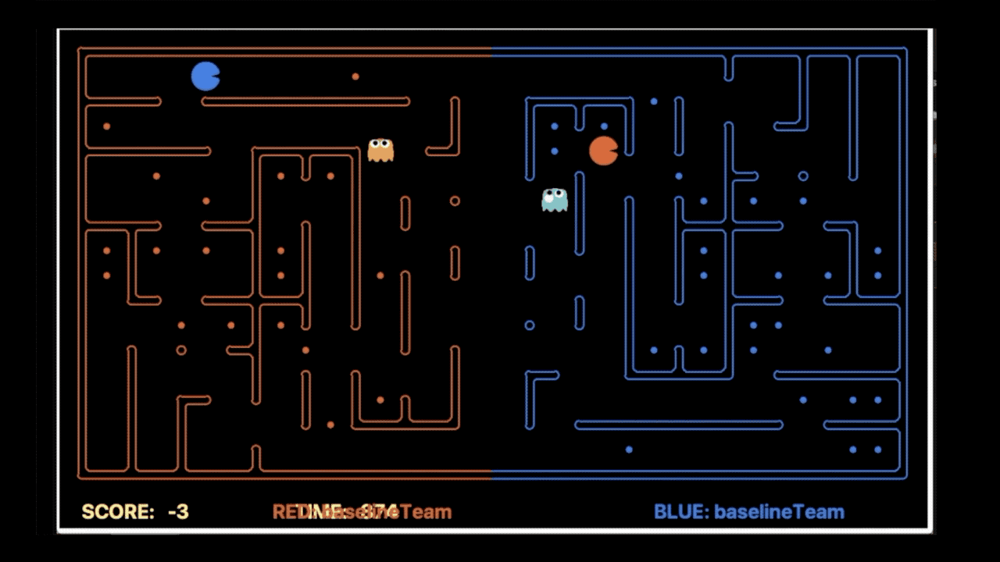
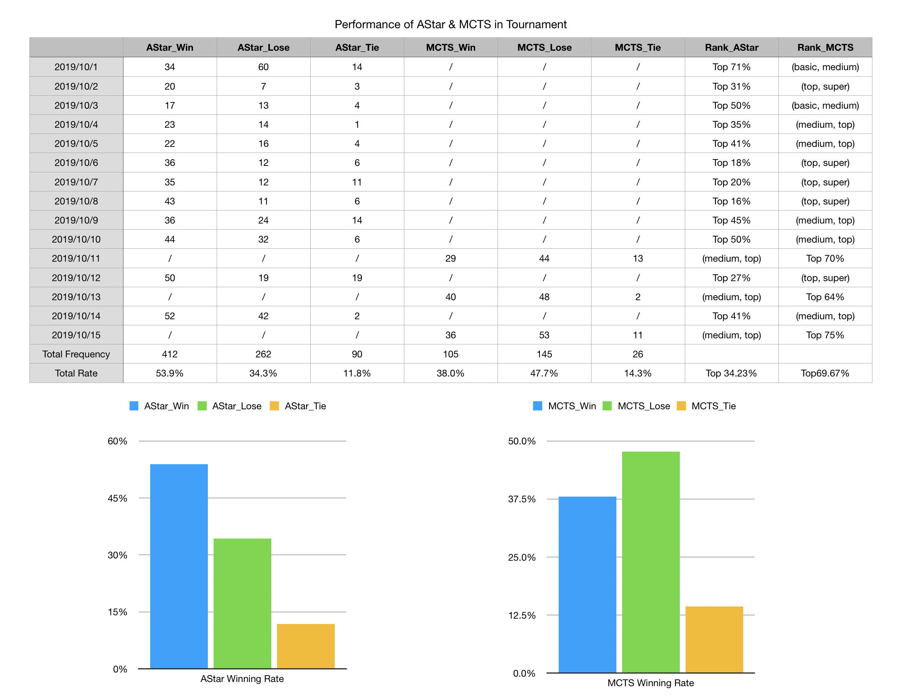

# UoM COMP90054 Contest Project

* [1. Home](#uom-comp90054-contest-project)
* [2. Design Choices](#design-choices)
  * [2.1 Heuristic Search Algorithm](#heuristic-search-algorithm)
  * [2.2 Monte Carlo Tree Search](#monte-carlo-tree-search)
* [3. Capture the Flag Contest](#capture-the-flag-contest)
  * [3.1 Performance in Competitions](#performance-in-competitions)
  * [3.2 Comparisons of Our Agents](#comparisons-of-our-agents)
* [4. Conclusion](#conclusion)

## YouTube presentation:

[Our Video](https://youtu.be/mwvDWWp-Rd4)

## Team Name

ViTa

## Team Members

1. Renjie Zhong - renjie@student.unimelb.edu.au - 961201
2. Zutian Nie - zutiann@student.unimelb.edu.au - 985057
3. Jingyin Chen - jingyinc@student.unimeb.edu.au - 971159

# Design Choices

The goal of this project is to design our own working Pacman agent and beat other teams in a Pacman tournament named Pacman Capture the Flag. 
In this project, we attempted two different techniques for the agents: Heuristic Search (a\*) and Monte-Carlo Tree Search (MCTS). 
For the final submission, we selected Offensive and Defensive agent both based on Heuristic Search (a\*).

[Back to top](#uom-comp90054-contest-project)

## Offensive Agent

An a* search algorithm is implemented using our defined heuristic functions. Besides, several basic functions are defined to obtain different goal states. 
To cope with different scenarios, we implemented a series of strategies for attacker and defender respectively, which help them to choose actions effectively.

[Back to top](#uom-comp90054-contest-project)

## Defensive Agent

In addition to the a* agent, we also implemented a defensive agent that uses the Monte-Carlo Tree Search algorithm. The most challenging part is defining various terminating states and their values. 
Moreover, the number of steps in the random simulation and the number of simulations for each state will also have a great impact on the performance. Therefore, in the process of optimizing this method, the adjustment of the parameters took a lot of time.

[Back to top](#uom-comp90054-contest-project)

## Heuristic Search Algorithm

### Basic Functions

Before the implementation of a* algorithm, the following basic functions are defined:

- Get middle line between team Red and team Blue
- Get nearest middle line for our agents
- Get nearest opponent attacker
- Get nearest food to eat and defend
- Get nearest capsule to eat
- Get nearest food that can be directly eaten without turning back
- Get nearest last eaten food by opponent attacker
- Get successors after expanding a node in a* search

[Back to top](#uom-comp90054-contest-project)

### Heuristic Functions and a* Search Algorithm

- A null heuristic function that just returns 0 as the heuristic value is defined. It is used when our defender chases opponent's attacker, 
which is unnecessary to add a heuristic value to estimate the cost from the current position to the attacker.
- A heuristic function for our attacker that is to avoid opponent defenders when eating food. When they get close to each other (less than 3 steps), 
it is defined by doing a exponential operation on the distance between my attacker's position and opponent defender's position and 
choosing the maximum one as the heuristic value to estimate the cost of the optimal path.
- A heuristic function for our defender that is to avoid opponent attackers when becoming scared. When they get close to each other (less than 3 steps), 
it is defined by doing a exponential operation on the distance between my defender's position and opponent attacker's position and 
choosing the maximum one as the heuristic value to estimate the cost of the optimal path.
- An a* search algorithm that search for the node which has the lowest combined accumulated cost and heuristic value.

[Back to top](#uom-comp90054-contest-project)

### Strategy

For both defender and attacker, the first goal is to reach the nearest middle line.

[Back to top](#uom-comp90054-contest-project)

#### Attacker

- It traces five kinds of components when choosing an action each time: **opponent's attackers and defenders**, **nearest food to eat**, **nearest capsule** and **nearest middle line**.
- If our attacker which is not yet reaches the nearest middle line becomes scared, when it gets close to opponent's attacker (less than 3 steps), 
our attacker just goes home to avoid being eaten.
- If our attacker is carrying food more than 10, or it may not return to our boundary before the contest ends, 
it stops eating and starts heading to the nearest middle line.
- If opponent's defender gets close to our attacker (less than 4 steps), or its scared timer is less than 11 (imply it will soon become a normal defender), 
our attacker also stops eating and starts heading to the nearest middle line.
- If there is food that can be directly eaten without turning back and opponent's defender is not close to the food (more than 0 step), 
our attacker starts heading to the nearest directly available food; otherwise, it returns back to the nearest middle line.
- If opponent's defender's scared timer is more than 10, or it is far from the nearest food (more than 10 steps),
our attacker will eat food freely.
- If there is no food that can be directly eaten without turning back, when opponent's defender is not close to the nearest capsule (more than 0 step) or
its scared timer is more than 10 (imply it cannot become a normal defender soon), our attacker starts heading to the capsule; otherwise, it returns back to the nearest middle line.
- To guarantee the food carried by our attacker to be safely returned, if there is no food left, or there is no capsule and opponent's defender is chasing our attacker,
our attacker starts heading to the nearest middle line.
- Except for above scenarios, our attacker will normally search for the nearest food.

[Back to top](#uom-comp90054-contest-project)

#### Defender

- It traces four components when choosing an action each time: **opponent's attackers**, **nearest middle line**, **nearest last eaten food** and **nearest food to defend**.
- Each time it will update the number of food to defend according to the number of food returned by opponent's attacker at first.
- To guarantee my defender not to become an attacker, when it reaches the nearest middle line, it will immediately go home, which makes it move around the nearest middle line.
- If our defender reaches the nearest last eaten food but does not observe opponent's attackers, it starts searching for the nearest food to defend and 
meanwhile searching for opponent's attackers.
- If our defender becomes scared, when it gets close to opponent's attacker (less than 3 steps), the defender just goes home to avoid being eaten.
- If there is an attacker being observed, our defender starts to chase the nearest attacker.
- If there is no attacker being observed but our food to defend is decreasing, our defender starts heading to the nearest last eaten food and 
meanwhile searching for opponent's attackers.
- Except for above scenarios, our defender will normally head to the nearest middle line.

[Back to top](#uom-comp90054-contest-project)

### Strengths

- Attacker has a good performance above average level. It works effectively under various scenarios using "if-else" clause.
- Errors such as timeout are avoided in the contest as agents react quickly to opponent move.

[Back to top](#uom-comp90054-contest-project)

### Weakness

- Attacker sometimes gets too greedy that it goes into a dead end and is eaten by ghost.
- Both attacker and defender are not able to predict further move of opponents, which leads to the restriction that they can only respond to immediate action of opponents.

[Back to top](#uom-comp90054-contest-project)

## Monte-Carlo Tree Search

### Description

- In the initial state, the value returned by all legal actions in the random simulation will be 0. Since we will select the action with the highest value returned by simulation as the next action, in this case, a random action is selected to execute because the value of all actions is 0. Furthermore, if the maximum value of all actions is more than 900, our agent will select the action according to the logic of a* algorithm, which can avoid unnecessary random actions affecting the overall performance of our agent.
- Then, when the enemy attackers are observed by our defender, the value returned by simulation will no longer be 0. If the defender does not detect the enemy attacker’s position temporarily, it will head to the nearest eaten food or the nearest food to defend. We will do random simulation for all legal actions in the current state, and then execute the action with the highest value returned.
- Previous steps are repeated in each step.

[Back to top](#uom-comp90054-contest-project)

### Strategy

For the MCTS defensive agent, the main goal is to search for enemy offensive agents. But in the process of chasing, the defensive agent should also pay attention to whether our agent is in a state of being scared.

- Our MCTS defender will simulate all legal actions, and the simulation process is implemented by random movement.
- In the process of simulation, if the current state has been rewarded, then it is judged as a terminating state and immediately executes back-propagation.
- The next action is selected based on the highest value returned.
- Finally, if the reward is less than 901, then the action is selected according to the logic of the a* algorithm to avoid the agent performing some "stupid" operations.

[Back to top](#uom-comp90054-contest-project)

#### Assigning Rewards

- Nearest food - a small positive value will be returned when there is no attacker nearby at the nearest eaten food, which leads the defensive agent to the nearest food.
- Get scared - a high positive reward will be returned when the defensive agent is in the scared state and near to the enemy’s attacker.
- Enemy attacker's position - a high positive reward will be returned when our defender detects enemy attacker’s position directly. The closer the distance from the enemy attacker, the higher the returned value.
- Nearest eaten food - a small positive value will be returned when our defender cannot detect the attacker directly and our food is decreasing. This will lead our agent to the nearest eaten food.

[Back to top](#uom-comp90054-contest-project)

### Strengths

- Random simulation can simulate the subsequent steps of the game, thus selecting the global optimal action.
- Different reward values represent different importance of an action chosen in a particular scenario. It will choose the action most effectively when escaping or searching for the nearest attackers if the distance is less than 2. If the distance is less than 3, it will choose the action less effectively than the previous scenario. And searching for the nearest eaten food or the nearest food is the least important in simulation.

[Back to top](#uom-comp90054-contest-project)

### Weakness

- It is difficult to define the reward of various terminating states. If the reward setting is unreasonable, then the MCTS agent sometimes makes some "stupid" behavior.
- If the number of steps in the random simulation and the number of simulations for each state are too large, the running time of each step will become very slow. Timeouts often occur when testing on the server. If the number of simulations and the number of steps are too small, the performance of the agent is not ideal.

[Back to top](#uom-comp90054-contest-project)

# Capture the Flag Contest

## Performance in competitions

As the competition was run once daily, we found it is necessary to test our agents for improvements against older versions. 
The GIFs are the performance of two agents in different scenarios.

[Back to top](#uom-comp90054-contest-project)

### a*

* GIF 1: Attacker detours to get rid of opponent defender and eat food successfully.

* GIF 2: Defender can effectively defence two attackers at the same time.

* GIF 3: Attacker is unable to detect the dead end.

  

[Back to top](#uom-comp90054-contest-project)

### MCTS

* GIF 4: Defender successfully predicts the intention of enemy attacker, therefore avoiding food below to be eaten.

* GIF 5: Defender shows "stupid" behavior, as it should predict the movement of enemy attacker in advance and wait at the exit rather than blindly chasing after it.

  

[Back to top](#uom-comp90054-contest-project)

## Comparisons of Our Agents

### Performance Comparison

The table is the performance statistics of two agents in tournaments during the last two weeks. As a* agent is better than hybrid agent (a* attacker and MCTS defender), we test a* agent more often.
In over 560+ rounds of games, our a* agent wins 412 rounds, which is over 53% of the games and loses only 34% of the games. It can beat staff-basic, staff-medium and staff-top teams in most contests and has the ability to beat staff-super team in several maps.
As for hybrid agent, it only wins 38% of the total 270+ games and loses 47.7% of the games, and it can only surpass 30% of all teams. In tournament contest, this agent can only rank between staff-medium and staff-top teams, which obviously cannot perform as well as a* agent.

[Back to top](#uom-comp90054-contest-project)

### Evolution of Our Agents

#### Versions of a*

    v1: (10/1 - 10/2)
    Initial implementation.

    v2: (10/3 - 10/5)
    Modify the calculation method of heuristic value.
    Modify a* search to weighted a* search (weight = 2).
      
        a) attacker: 
        Add strategy: guarantee the food carried to be returned.
        Modify strategy: to search for the nearest food to eat, if the distance between attacker and opponent defender is more than 10.

        b) defender:
        Add strategy: guarantee my defender not to become an attacker.

    v3: (10/6 - 10/8)
    Add a basic function to get directly available food.
    Modify the calculation method of heuristic value.
    Revert weighted a* search to a* search.

        a) attacker:
        Add strategy: when to search for the nearest directly available food to eat.
        Modify strategy: 
        To escape, if opponent defender's scared timer is less than 20.
        Guarantee attacker return before the contest ends.

        b) defender:
        Modify strategy: to escape, if defender's scared timer is more than 0.

    v4 (i.e. myTeam, 10/12 - ):
    Add a basic function to get the nearest food to defend.
    Modify strategy: to return back to the nearest middle line, if the number of carrying food is more than 10.

        defender:
        Add strategy: when to search for the nearest food to defend.

[Back to top](#uom-comp90054-contest-project)

#### Versions of MCTS (only defender)

    v1: (10/11)
    Initial implementation.

    v2: (10/13)
        simulation: 
        Add when to escape.
        Adjust reward values of when to escape and when to search for the nearest attacker.
        Reset the number of steps to 25.

        MCTS search:
        Reset the number of simulations for each state to 50.
        Choose action based on simulation if the total reward is more than 100.

    v3 (i.e. myTeamUnusedMCTS, 10/15):
        simulation: 
        Add when to search for the nearest food to defend.
        Add when to search for the nearest eaten food.
        Reset the number of steps to 20.

        MCTS search:
        Reset the number of simulations for each state to 20.
        Choose action based on simulation if the total reward is more than 900.

[Back to top](#uom-comp90054-contest-project)

# Conclusion

## Final Model

`Pure A-Star-based agent`

### Reason

* With respect to the above results, it is obvious that our a* agent is more effective and performs better than hybrid agent (a* attacker and MCTS defender). Both the rank and winning rate of a* is superior to hybrid agent. From hybrid agent positions in contests, we can see that it only has the ability to beat staff-medium and staff-top teams. However, for a* agent, it can even surpass staff-top in 33% of contests, and between medium and top in 41.7% of contests.
* a* agent has a good evolution to cope with different scenarios. We can see from the table above that a*-v1 is not so stable as sometimes it can be Top 30%, but sometimes only Top70%. However, starting from a*-v2, the general performance is good and the new version has a rank of over Top 40%. a*-v3 even has three times of Top 20%. Although there were variations of maps and the enhancement of staff teams' ability, when it comes to a*-v4, the rank is still about Top 33%.
* The reason not to use MCTS algorithm in defender is that rewards in simulation are not easy to define in various terminating states. There are four values need to assign: **Enemy position**, **Get scared**, **Nearest food**, **Nearest Eaten Food**. It is also challenging to define the number of steps in the random simulation and the number of simulations for each state. The MCTS defender sometimes timeouts or has unreasonable performance.

[Back to top](#uom-comp90054-contest-project)

## Future Directions

* Add the judgement of dead end for both attacker and defender. With this judgement, attacker can avoid searching for food if opponent defender is chasing and defender can exactly wait at the exit of the dead end and prevent opponent attacker from escaping.
* Set the appropriate rewards to MCTS defender and together with a* attacker to develop an improved hybrid model.
* Try Q-learning algorithm to learn an optimal policy.

[Back to top](#uom-comp90054-contest-project)
